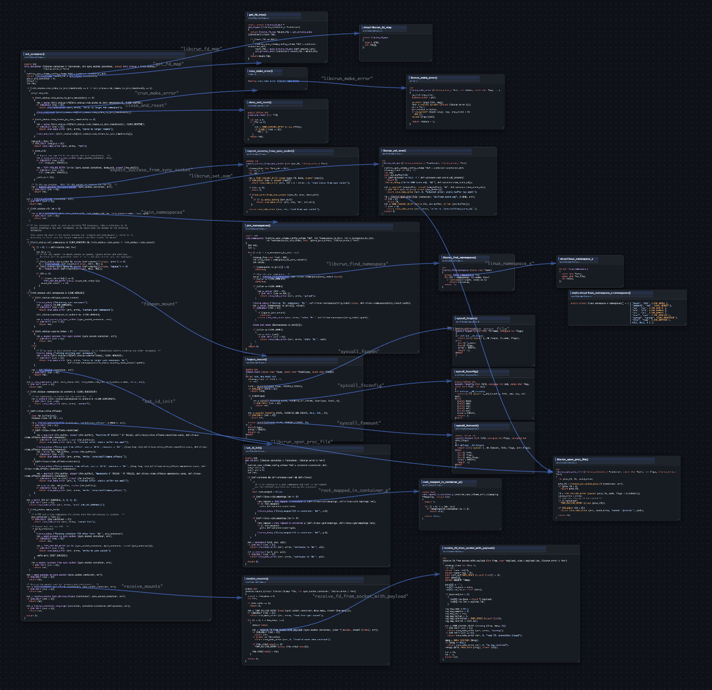
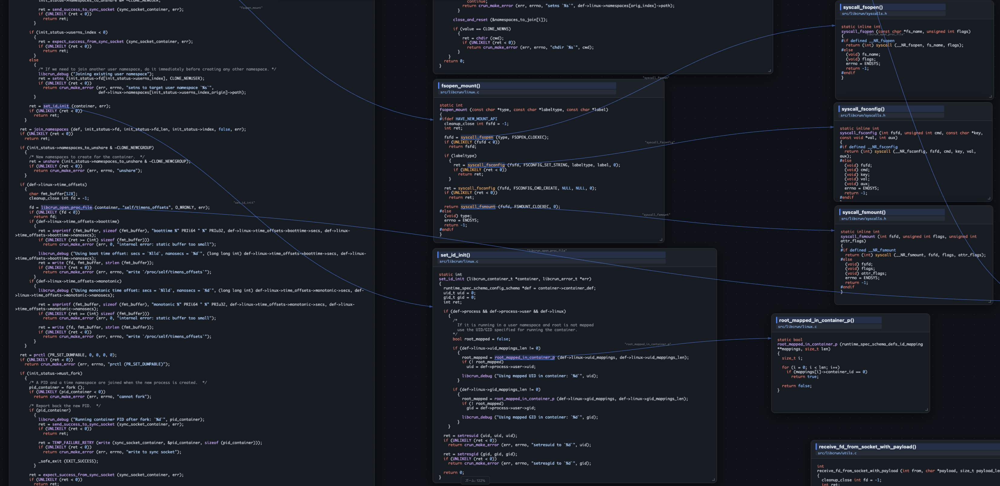

# 概要

ソースコードを読んで理解するためのブラウザベースのツールです。無限キャンバス上にコードスニペットを視覚的に整理し、相互に接続できます。





# 機能

- **コードブロック**: リサイズ可能な矩形の中にコードを配置できます。各ブロックにタイトルとファイルパスを設定できます。
- **シンタックスハイライト**: コードの内容から言語を自動検出し、適切にハイライト表示します。
- **リンク**: コードブロック内の文字列（関数名など）を選択し、別のブロックへ矢印で接続できます。クリックするとジャンプ先へ移動します。
- **無限キャンバス**: Miro風のナビゲーション（ドラッグでパン、Cmd+ドラッグでズーム、v/hでモード切替）。
- **保存 / 読み込み**: JSONとしてエクスポート・インポートできます。


# JSON出力フォーマット

## トップレベル

| フィールド | 型 | 説明 |
|---|---|---|
| `canvasTitle` | string | キャンバス全体のタイトル |
| `nodes` | Node[] | コードブロックの配列 |
| `links` | Link[] | リンクの配列 |
| `nid` | number | 次に割り当てるノードIDのカウンター |
| `lid` | number | 次に割り当てるリンクIDのカウンター |
| `vp` | Viewport | ビューポートの状態 |
| `gitConfig` | GitConfig | キャンバスに関連付けられたGitリポジトリの設定 |

## Nodeオブジェクト（コードブロック）

`type` フィールドが存在しない、または `"code"` の場合、ノードはコードブロックです。

| フィールド | 型 | 説明 |
|---|---|---|
| `id` | number | 一意のノードID |
| `x` | number | キャンバス上のX座標 |
| `y` | number | キャンバス上のY座標 |
| `w` | number | 矩形の幅 |
| `h` | number | 矩形の高さ |
| `code` | string | コードの内容 |
| `lang` | string | 言語（自動検出結果、例：`"cpp"`、`"rust"`） |
| `title` | string | コードブロックのタイトル |
| `filePath` | string | コードが属するファイルのパス |
| `showLineNumbers` | boolean | 行番号を表示するかどうか（デフォルト：`true`） |
| `lineNumberStart` | number | 先頭行に表示する行番号（デフォルト：`1`） |

## Nodeオブジェクト（吹き出し）

`type` が `"bubble"` の場合、ノードは吹き出しです。

| フィールド | 型 | 説明 |
|---|---|---|
| `id` | number | 一意のノードID |
| `type` | string | 固定値 `"bubble"` |
| `x` | number | 吹き出し本体の左上隅のX座標 |
| `y` | number | 吹き出し本体の左上隅のY座標 |
| `w` | number | 吹き出し本体の幅 |
| `h` | number | 吹き出し本体の高さ |
| `text` | string | 吹き出し内のテキスト |
| `tailX` | number | キャンバス上の尾部先端のX座標（本体とは独立して移動可能） |
| `tailY` | number | キャンバス上の尾部先端のY座標（本体とは独立して移動可能） |

## Linkオブジェクト

| フィールド | 型 | 説明 |
|---|---|---|
| `id` | number | 一意のリンクID |
| `fromId` | number | 接続元ノードのID |
| `text` | string | 接続元ノードで選択されたテキスト（アンカーテキスト） |
| `toId` | number | 接続先ノードのID |

## Viewportオブジェクト

| フィールド | 型 | 説明 |
|---|---|---|
| `x` | number | ビューポートのXオフセット |
| `y` | number | ビューポートのYオフセット |
| `scale` | number | ズームレベル |

## GitConfigオブジェクト

キャンバス全体に関連付けられたGitリポジトリ情報です。ツールバーの「⎇ Git Config」ボタンから設定します。
GitHub URLを指定すると、GitHub APIを通じてブランチ名またはタグ名からコミットハッシュが自動解決されます。

| フィールド | 型 | 説明 |
|---|---|---|
| `url` | string | リポジトリURL（例：`"https://github.com/owner/repo"`） |
| `branch` | string | ブランチ名（例：`"main"`）。設定した場合、そのブランチのHEADコミットを使用します。 |
| `tag` | string | タグ名（例：`"v1.0.0"`）。設定した場合、そのタグのコミットを使用します。 |
| `commitHash` | string | コミットハッシュ。ブランチ/タグが指定された場合、GitHub APIで自動解決されます。 |

`branch` または `tag` のどちらか一方を指定してください。両方省略した場合は `commitHash` がそのまま使用されます。

## サンプル

```json
{
  "canvasTitle": "crun_code_reading",
  "nodes": [
    {
      "id": 1,
      "x": 88.25,
      "y": 225.65,
      "w": 989.5,
      "h": 2962.2,
      "code": "static int\ninit_container (...) { ... }",
      "lang": "cpp",
      "title": "init_container()",
      "filePath": "src/libcrun/linux.c",
      "showLineNumbers": true,
      "lineNumberStart": 1
    },
    {
      "id": 2,
      "type": "bubble",
      "x": 300.0,
      "y": 100.0,
      "w": 200,
      "h": 80,
      "text": "Namespaces are initialized here",
      "tailX": 250.0,
      "tailY": 220.0
    }
  ],
  "links": [
    {
      "id": 1,
      "fromId": 1,
      "text": "get_fd_map",
      "toId": 3
    }
  ],
  "nid": 7,
  "lid": 6,
  "vp": {
    "x": 76.9,
    "y": -6.8,
    "scale": 0.7
  },
  "gitConfig": {
    "url": "https://github.com/containers/crun",
    "branch": "main",
    "tag": "",
    "commitHash": "a1b2c3d4e5f6..."
  }
}
```
